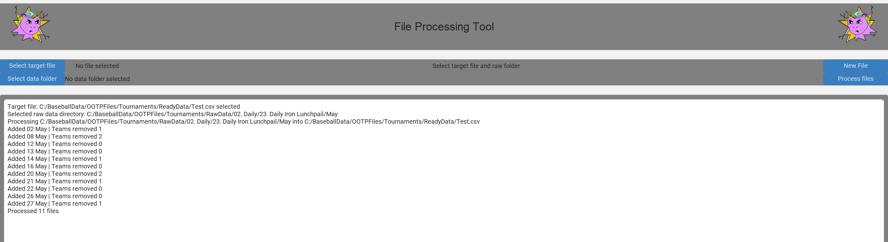

#  Angered Unicorn's OOTP Tournament Utilities and Tools   

Welcome to the home for my OOTP Tournament Tools.  

This is a desktop utility for processing and analyzing OOTP Baseball tournament data. 

- Bug reports: [FORM](https://docs.google.com/forms/d/e/1FAIpQLSdAmXv6rTwoBw9ipBdeSc7qvyV7IO83CpIVkEX5_aEbgwpy6w/viewform?usp=sharing&ouid=112838883589285917619)
- Feature requests: [FORM](https://docs.google.com/forms/d/e/1FAIpQLSftrpDw8ypLglDXteZAT0uo7H5NqkJf9UKdBCjX1OEvpKp66w/viewform?usp=sharing&ouid=112838883589285917619)

---

## Current Features (v 0.1.3 alpha)

- 🗃️ File Processing for OOTP CSV exports
- ⚙️ Editable settings with JSON-based configuration
- ✨ CustomTkinter GUI with consistent header/footer layout
- 📳 Modular app design using subprocess launching
- ➡️ Linted with flake8 with docstring support
- 🗿 Basic Batter and Pitcher stats with sorting, player search and role selection
- 🫂 Basic team stats with highlighting of selected team

---

## Getting Started

### Installation

- Windows users should use the most up-to-date Windows installation from the releases section on the right

  - The installer will run through prompts to get the application setup, and I recommend default settings

- macOS users should use the most up-to-data macOS file based on their system (Intel based or non-Intel based)

  - The zip file should be run from the file where it downloads and should extract into that folder

### Initial Startup

- Set window sizes (1920x1080 minimum recommended)
- Set target folders and files for file processing

  - RECOMMENDED:  Have one main folder for your processed files and individual raw data folders for each tournament
  - Setting targets is not mandatory but is recommended for improving your workflow
  - View should include the following stats, in this order:
     - Tag Controls, PT Card ID, Organization, PT Card Value, PT Is Variant, PT Variant Level, (Batter) G, GS, PA, AB, H, 1B, 2B, 3B, HR, RBI, R, BB, IBB,
       HP, SH, SF, SO, GIDP, EBH, TB, RC, RC/27, wOBA, WPA, WAR, SB, CS, wSB, UBR, BsR, (Pitcher) G, GS, W, L, SVO, SV, BS, HLD, SD, MD, IP, BF, AB, HA, 1B,
       2B, 3B, HR, TB, R, ER, BB, IBB, K, HP, SH, SF, WP, DP, IR, IRS, QS, CG, SHO, GB, FB, SB, CS, FIP, WAR, TC, A, PO, E, DP, TP, PCT, ZR, SBA, RTO

### Settings

- By default, your target folders and files will be set to C:\, you will need to use the Edit Settings menu to move them

- I recommended that you set up a Raw Data and Ready Data folder (or similar names) and set your initial_target_folder and initial data folders to these

  - The initial_target_folder is where the template will be sent to when you use the "New File" command in the File Processing App

- MANDATORY: You MUST set the target_card_list_file to be linked with your card list export file from OOTP Baseball

  - By default, this file is exported to c:\<user>\Documents\OOTP Developments\OOTP Baseball 26\online_data\card_list.csv

- OPTIONAL: The target_collection_list_file is currently unused, but is designed to be linked to a file that exports your collection (hide duplicates to keep size down) with just the Card IDs in the file.  This is for future use.

### File Processing

- Export file as a CSV from your "Sortable Statistics" page

  - By default, this file will be automatically exported to your "\<user>\Documents\OOTP Developments\OOTP Baseball XX\online_data" folder

- Move this CSV to your raw data folder for the currently working program
- In the File Processing application, select the target (destination) file for your main tournament data and 
the folder you are importing data from
- Press the "Process Files" button and all CSV's in the folder that are not already in the file will be added
- NOTE: The application uses the name of the file to determine whether it is already in the target dataset (i.e. 24 May)
- NOTE: I expect the initial release of the statistic to use DateTime for sorting, with a future update being able to 
manage between DateTime and integers.  For now, I recommend labeling your raw data in DD MMM format.  I will advise when
this becomes obsolete.

### Basic Batting and Pitching Stats

- Simply select the processed CSV you want to see the data for and process the file.  You can filter batters by position.  Starter/reliever filtering will be in the next update.
- All columns can be sorted by clicking on the header and will reverse (ascending/descending) when sorted again.
- By default, no stat columns will be selected, the user is able to select as few or as many columns to select as the want
  - Default stats always visible are CID, Title, Bat/Pitch side, and Plate Appearances/Innings Pitched

### Individual Batter and Pitcher Stats

- Double-clicking on a player on the basic stats page will open a player card allowing the user to view:

  - Player ratings including offense, defense, pitching and individual pitches
  - Individual player stats for all instances of the player
  - Individual player stats for selected team, if applicable
  - A chart displaying player trends, with selectable stats (more to be added in the future)

### Basic Team Stats

- After selecting a file, using the "Get Teams List" button will populate the dropdown with all the teams found in the file
- You do not have to select your team, but doing so will highlight your team in the list to make it easier to find
- Similar to the batting and pitching stats, the user is able to select which stats they want to view
  - Default stats always visible are team games play, wins, losses and winning percentage

___
# Release Information

### v0.1.13

- Initial release
- File processing utility

### v0.1.16

- Fixed pathing issue for creation of new file from program template

### v0.1.17

- Minor UI adjustments

### v0.1.2.19

- Basic batting and pitching stat views
- Initial release of macOS compatible ZIP build
- Renamed release numbers to be more accurate with project progress

### v0.1.2.20

- Add variant splitting to basic stats
- Add pitching stats menu including:

  - Minimum innings pitched
  - Variant splitting option box
  - Starter/relief pitching cutoff variable
  - Pitcher role select buttons

### v0.1.2.21

- Add batter/pitcher handedness options
- Add player search function
- Fix DPI scaling issue on Windows systems

### v0.1.2.26 (Windows), v0.1.2.11 (macOS), v0.1.2.4 (macOS Intel)

- Add basic team stat views
- Fix potential pathing issue for macOS settings read/write
- Refactor stats calculations and some frames for modularity

### v0.1.2.32 (Windows), v0.1.2.17 (macOS), v0.1.2.9 (macOS Intel release)

- Add basic player card functionality for batters and pitcher

  - Show player ratings and stats for all instances and for selected team

- Display trends for individual batters and pitchers over time
- Add card rating min and max tool on main stats page

---

## Upcoming Features and Improvements

- Team analysis
- Player comparison tool
- Player and tournament statistics over time

### Authored By
- David Wright
- Github: [David Wright](https://github.com/davwright3)
- LinkedIn: [David Wright](https://www.linkedin.com/in/davidwright79/)
- Twitch: [Angered_Unicorn](https://www.twitch.tv/angered_unicorn)
- Join me on Discord: [Angered_Unicorn](https://discord.gg/pfBPmFS)

- Bug reports: [FORM](https://docs.google.com/forms/d/e/1FAIpQLSdAmXv6rTwoBw9ipBdeSc7qvyV7IO83CpIVkEX5_aEbgwpy6w/viewform?usp=sharing&ouid=112838883589285917619)
- Feature requests: [FORM](https://docs.google.com/forms/d/e/1FAIpQLSftrpDw8ypLglDXteZAT0uo7H5NqkJf9UKdBCjX1OEvpKp66w/viewform?usp=sharing&ouid=112838883589285917619)

